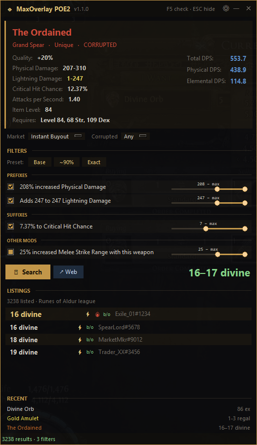
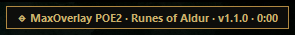

# MaxOverlay POE2

A screen-reading **price-check overlay for Path of Exile 2** — press one key
over any item and get live market prices in a floating window.

Built for **cloud gaming** (Boosteroid and similar), where the clipboard never
reaches your machine and tools like Awakened PoE Trade can't work: MaxOverlay
reads **pixels only** (native Windows OCR), so it runs anywhere you can see the
game. It works just as well on a normal local install.

> Currently targets **PoE2**. PoE1 support may come in the future — everything
> game-specific lives in the data sources, so the core is reusable.

---

## Screenshots

<p align="center">
  
</p>

While the overlay sleeps, a tiny draggable status pill shows it's running
(league · version · uptime) — click it to open the overlay:

<p align="center">
  
</p>

## Features

- **One hotkey (F5)** over any item → identifies it by name on screen and
  fetches prices. No clipboard, no game hooks — just a screenshot and OCR.
- **Instant Buyout market by default**: searches the PoE2 instant-buyout
  marketplace (`securable`), where ~99% of real listings live. Optional
  modes: Buyout + In Person, In Person only, Any. Listings show ⚡ (instant)
  and 🔥 (in demand) badges.
- **Weapons & armour filter by their numbers**: Total/Physical/Elemental DPS,
  crit, attacks per second, armour, evasion, energy shield, ward, spirit —
  computed from the tooltip and pre-wired as range filters.
- **Uniques price by roll**: a unique's affixes come pre-enabled with your
  item's exact rolls as minimums, so a high-roll unique shows its real value
  (1 div) instead of the floor price (1 ex).
- **Rares**: combined pseudo-stats (total resistances, life…) plus per-mod
  range sliders, grouped like the game reads: **Prefixes first, Suffixes
  second**.
- **One-click presets** (Awakened-style): `Base` / `~90%` / `Exact` re-target
  every filter and re-search instantly.
- **Trade-site style item card**: properties one per line with game colors
  (fire red, cold blue…), computed DPS block on the right.
- **Currency & gems**: real Currency Exchange prices (volume-weighted) from
  [poe2scout](https://poe2scout.com), matching the in-game market ratio, with
  price history. Exalted prices ≥1 divine also show a `≈X div` hint.
- **Smart placement**: the overlay opens on the opposite side of the screen
  from your cursor and slides aside if it would ever cover the game tooltip.
- **In-app Settings (⚙)**: league selector (live list), rebindable hotkeys
  (applied without restart), behavior toggles. Stored in
  `%LOCALAPPDATA%\MaxOverlay-POE2\config.json`.
- **RECENT history**: your last checks, clickable to reopen the web search.
- **Rate-limit safe**: a real limiter paced to the trade API's published
  rules, a 10-minute result cache, and a clear "wait Ns" banner if the API
  ever throttles you (no more silent fake "0 results").

## Download (no Python required)

1. Go to the [**Releases**](../../releases) page.
2. Download `MaxOverlay-POE2.exe`.
3. Run it. First launch downloads the item/stat databases (a few seconds),
   then it sleeps in the background until you press F5 over an item.

> Windows may warn about an unsigned executable (SmartScreen). Click
> *More info → Run anyway*. The app is open source — read every line here or
> build it yourself (below).

## Usage

| Key (default)    | Action                                           |
|------------------|--------------------------------------------------|
| **F5**           | Price-check the item under the cursor            |
| **F6**           | Open the current search on the trade website     |
| **F8**           | Refresh the item/stat databases                  |
| **ESC** / right-click | Hide the overlay                            |
| **Ctrl+Shift+Q** | Quit                                             |

All hotkeys are rebindable from the ⚙ Settings window.

Hover an item, press **F5**: the overlay shows the item card, editable
filters and live listings. Use the `Base / ~90% / Exact` presets or adjust
sliders and press **Search**. `↗ Web` always opens **your** filtered search
on the official trade site.

## Run from source

Requires **Windows 10/11** and **Python 3.10+**.

```bat
git clone https://github.com/MaxDistroyer/MaxOverlay-POE2.git
cd MaxOverlay-POE2
python -m venv .venv
.venv\Scripts\activate
pip install -r requirements.txt
python maxoverlay.py
```

## Build the .exe yourself

```bat
build.bat
```

Creates a venv, installs runtime + build deps (PyInstaller) and produces
`dist\MaxOverlay-POE2.exe`. Build config lives in [`maxoverlay.spec`](maxoverlay.spec).

## How it works

1. **Capture** the whole screen (`mss`).
2. **OCR** it with the native Windows OCR engine (`winrt`), keeping each
   line's on-screen position.
3. **Identify** the item by fuzzy-matching every line (and adjacent pairs)
   against the PoE2 item database with an inverted word index — item names
   match with high scores; chat/minimap/UI text doesn't.
4. **Collect** the tooltip's lines (same column, below the name), map mods to
   trade `stat_id`s, compute DPS/defenses, and build the filter set.
5. **Price** it: the official `trade2` API (instant-buyout market) for gear,
   [poe2scout](https://poe2scout.com) for currency/gems.

Cache and config live in `%LOCALAPPDATA%\MaxOverlay-POE2` (no admin needed).

## Limitations

- **Windows only** (uses the Windows OCR engine).
- OCR accuracy depends on stream/render quality; if an item isn't recognized,
  re-point and press F5 again (the overlay shows what the OCR read as a hint).
- Prefix/suffix grouping is heuristic; exotic mods land under "Other mods".
- Prices are as good as the public data sources allow.

## Contributing

Issues and PRs welcome. The whole app is a single file,
[`maxoverlay.py`](maxoverlay.py), with English comments. Good first issues:
an app icon, PoE1 support (data-source layer), exact affix tier data,
OCR tuning for non-English clients.

## ☕ Support

If MaxOverlay saves you a few exalts, you can support development through
[GitHub Sponsors](https://github.com/sponsors/MaxDistroyer) — entirely
optional, always appreciated.

## Credits & disclaimer

- Price data: the official **Path of Exile 2 trade API** and the community
  site **[poe2scout](https://poe2scout.com)**.
- Inspired by Awakened PoE Trade, Exiled Exchange 2 and PoE Overlay.

Not affiliated with or endorsed by Grinding Gear Games. Path of Exile is a
trademark of Grinding Gear Games. This tool only reads your own screen and
queries public trade data; it does not interact with the game client.

## License

[MIT](LICENSE)
